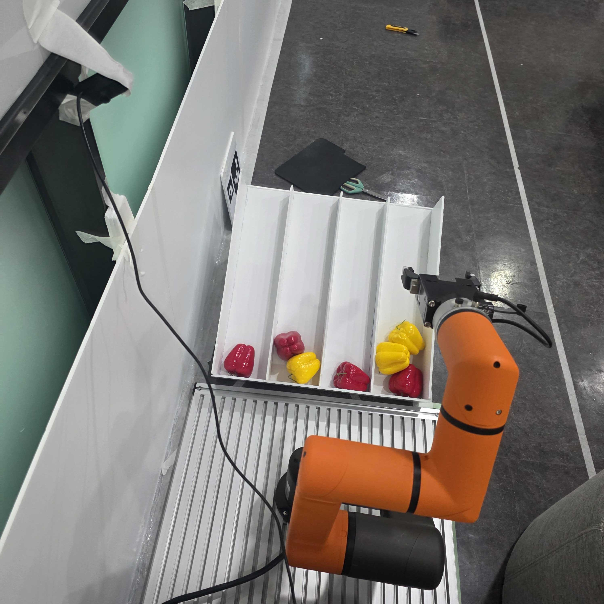

# HCR-3A 선별장 구현 완료 및 운영 인수인계

정리일 2026-10-06. 선별장 작업 완료는 사용자 보고 기준이다. 실제 코드와 대화의 현장 확인 기록을 대조하여 작성했다. 초기 OMX/모방학습 설계에서 현재 HCR-3A 고정 구역·티칭 제어 방식으로 전환한 과정을 보존한다.

## 시스템 구성

```text
USB 웹캠 → A/B/C/D ROI·HSV 빨강/노랑 판정 → state.json
                                               ↓
실제 관제 또는 더미 관제 → ROS SortBatch → PC hcr_sorter
                                               ↕ Modbus TCP
                                      HCR-3A / Rodi
                                      PICK → 색상 배출 → HOME
                                               ↓
관제 ← Status / Feedback / Result ← ACK·BUSY·DONE·READY
```

PC `.2:502`가 서버, HCR `.100`이 클라이언트다. PC는 물량 Task와 운반 JOB을 관리하고 Rodi가 실제 경로·그리퍼를 제어한다. A가 남아 있으면 새 JOB으로 A를 반복한다. 반환 후 새 프레임을 읽어 다음 대상을 고른다.

## 운영 기준

|항목|현재 코드/현장 기록|
|---|---|
|로봇|HCR-3A, 6관절, Rodi 2.009.000 Build 008_G2 사진 기준|
|환경|Ubuntu24.04 / ROS2 Jazzy / Python3.12|
|판정|고정4구역, 빨강·노랑, 기본 우선순위 ABCD|
|모션|Rodi 티칭점과 PICK_A~D, PLACE_AND_RETURN|
|그리퍼|Tool I/O 0열기/1닫기 사용자 확인; 최종 해결 세부 설정 미전달|
|관제|/sorter_01/sort_batch, /sorter_01/status, /sorter_01/reset_fault|
|정상 종료|네 구역 NO_COLOR 연속3초; 상류 잔량이나 파지센서 확인을 뜻하지 않음|
|취소|이미 발행한1회 완료·복귀 후 CANCELED, 완료 개수 보존|

## 문서 구성

- [작업공간·설치·네트워크](01_SETUP.md)
- [카메라와 A~D 색상 인식](02_VISION.md)
- [Rodi 프로그램·위치 티칭·그리퍼](03_RODI_GRIPPER.md)
- [실행·테스트·종료 안내](04_OPERATIONS.md)
- [문제 해결 기록](05_TROUBLESHOOTING.md)
- [검증 결과·산출물·변경 이력](06_VALIDATION_HISTORY.md)
- [데스크탑 인수인계](../HCR3A_DESKTOP_HANDOFF.md)

## 현장 사진



사용자가 완료 보고와 함께 제공한 사진이다. 로봇, 그리퍼, 네 레인과 빨강·노랑 대상물의 배치를 보여준다. 사진만으로 좌표·센서 검증·8개 분기의 성공률을 추정하지 않는다.

## 근거와 자료

- 코드 저장소: https://github.com/Robot3FinalProject/sorting
- 원본 참고 저장소: https://github.com/Robot3FinalProject/robotarm
- 기존 통신 문서: https://robot3final.atlassian.net/wiki/spaces/3/pages/12746755
- 기존 FSM: https://robot3final.atlassian.net/wiki/spaces/3/pages/5734447
- 이전 PDF2개는 당시 안내이며 최신 구현은 본 문서와 소스를 우선한다. 펜던트 네이티브 프로그램 백업과 최종 좌표는 별도 확보 대상이다.

## Confluence 게시본

- [HCR-3A 선별장 구현 완료 및 운영 인수인계](https://robot3final.atlassian.net/wiki/spaces/3/pages/30343169)
- [HCR-3A 작업공간·설치·네트워크](https://robot3final.atlassian.net/wiki/spaces/3/pages/29884432)
- [HCR-3A 카메라와 A~D 색상 인식](https://robot3final.atlassian.net/wiki/spaces/3/pages/29884461)
- [HCR-3A Rodi 프로그램·위치 티칭·그리퍼](https://robot3final.atlassian.net/wiki/spaces/3/pages/29720603)
- [HCR-3A 실행·테스트·종료 안내](https://robot3final.atlassian.net/wiki/spaces/3/pages/29949967)
- [HCR-3A 문제 해결 기록](https://robot3final.atlassian.net/wiki/spaces/3/pages/30081029)
- [HCR-3A 검증 결과·산출물·변경 이력](https://robot3final.atlassian.net/wiki/spaces/3/pages/29949996)
